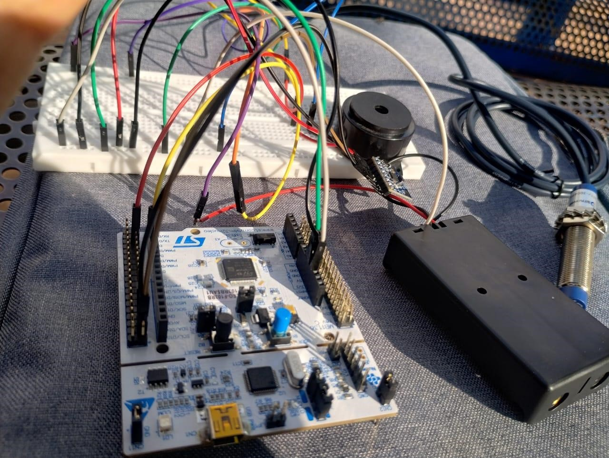
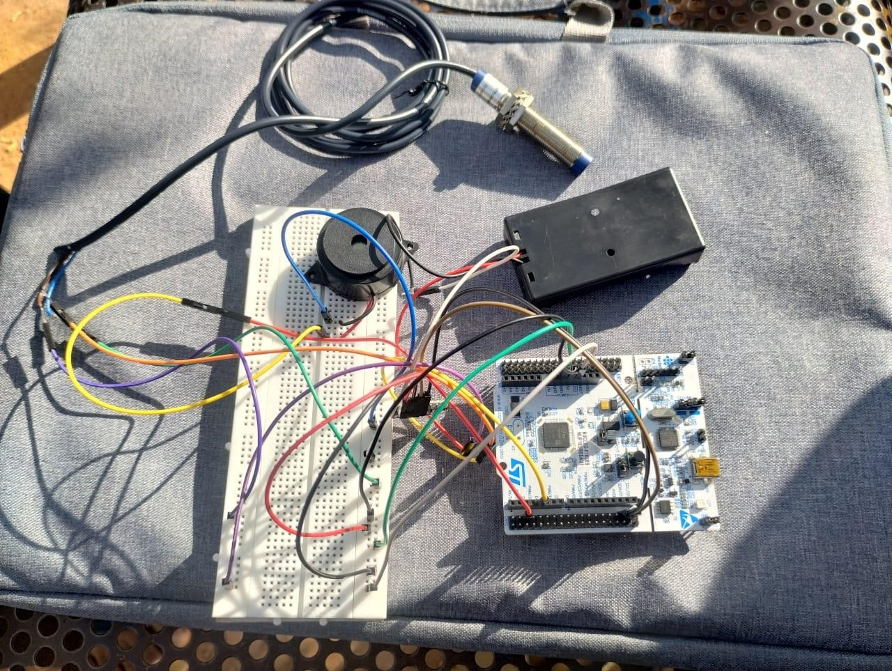
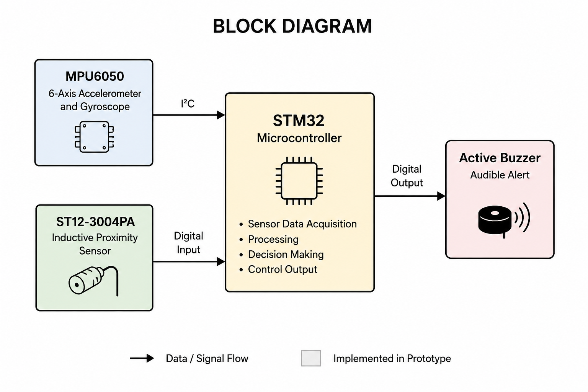

# Smart Helmet Safety System

A proof-of-concept embedded safety prototype developed using an STM32 microcontroller, an MPU6050 motion sensor, and an ST12-3004PA inductive proximity sensor.

The project demonstrates real-time sensor interfacing and proximity-based audible alerts using a physical hardware prototype. The broader smart helmet concept also explores features such as accident detection, ignition interlocking, and emergency notification as proposed future extensions.

## Overview

Road accidents involving two-wheelers can result in serious injuries, particularly when safety measures such as helmet usage and rapid accident response are not available.

This project explores a smart helmet safety system using embedded sensors and a microcontroller-based prototype. The implemented hardware uses an STM32 development board, an MPU6050 accelerometer and gyroscope, an ST12-3004PA inductive proximity sensor, and an active buzzer.

The prototype demonstrates sensor interfacing and real-time proximity detection. When the inductive sensor detects a nearby metallic object, the system activates an audible buzzer alert. The MPU6050 is used to acquire motion and acceleration data.

> **Note:** The physical prototype implements sensor interfacing, MPU6050 data acquisition, inductive proximity detection, and buzzer-based alerts. Features such as motorcycle ignition control, GPS tracking, GSM/Bluetooth emergency alerts, and a fully implemented accident-detection algorithm were part of the broader proposed system but were not implemented in the physical prototype.

## Implemented Features

The physical prototype demonstrates the following functionality:

- **STM32-based embedded prototype** for sensor interfacing and control
- **MPU6050 interfacing** for real-time accelerometer and gyroscope data acquisition
- **ST12-3004PA inductive proximity sensing** for detecting nearby metallic objects
- **Buzzer-based alert system** activated when the proximity sensor detects a metallic object
- **Real-time sensor monitoring** through the program's main control loop
- Physical hardware implementation using a development board, sensors, breadboard, and connecting circuitry

## Proposed Features

The broader smart helmet system was designed with several additional safety features that were proposed but not implemented in the physical prototype:

- Helmet-wearing detection
- Motorcycle ignition interlock using a relay
- Accident detection using calibrated MPU6050 thresholds
- GPS-based location tracking
- GSM or Bluetooth-based emergency notification
- Automatic alerts to predefined emergency contacts

## Hardware Components

| Component | Role |
|---|---|
| **STM32 Development Board** | Central microcontroller used for sensor interfacing and control |
| **MPU6050** | Provides accelerometer and gyroscope data for motion monitoring |
| **ST12-3004PA Inductive Proximity Sensor** | Detects nearby metallic objects |
| **Active Buzzer** | Generates an audible alert when triggered by the proximity sensor |
| **Breadboard and Jumper Wires** | Used for prototyping and hardware connections |
| **Power Supply** | Provides power to the prototype hardware |

## Hardware Prototype

The system was developed and tested as a physical proof-of-concept prototype using an STM32 development board, MPU6050 motion sensor, ST12-3004PA inductive proximity sensor, active buzzer, and breadboard-based connections.

### Prototype Setup



### Sensor and Circuit Setup



## System Architecture

The implemented prototype uses two sensors connected to the STM32 microcontroller. The MPU6050 provides motion data, while the ST12-3004PA inductive proximity sensor detects nearby metallic objects. Based on the sensor input, the microcontroller controls the buzzer output.



## Working Principle

The prototype operates through continuous sensor monitoring:

1. The STM32 initializes the connected sensors and output devices.
2. The MPU6050 provides real-time accelerometer and gyroscope data for motion monitoring.
3. The ST12-3004PA inductive proximity sensor continuously checks for the presence of a nearby metallic object.
4. The sensor state is read by the microcontroller.
5. When a metallic object is detected, the STM32 activates the active buzzer.
6. The buzzer remains active for the programmed alert duration and is then turned off.
7. The system continues monitoring the sensors in a continuous loop.

### Implemented Control Flow

```text
Start
  ↓
Initialize STM32, MPU6050 and Buzzer
  ↓
Read MPU6050 Motion Data
  ↓
Read Inductive Proximity Sensor
  ↓
Metal Object Detected?
   ├── Yes → Activate Buzzer
   │
   └── No  → Keep Buzzer OFF
              ↓
       Continue Monitoring
```
